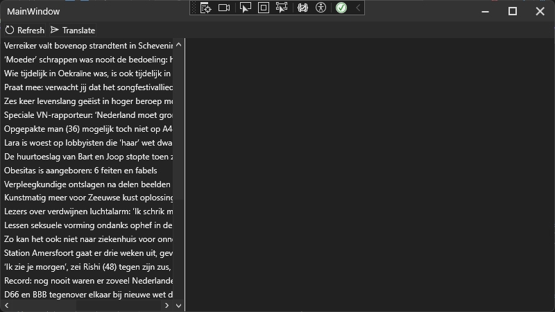

# RssFeedTranslatorDeepl
Rss feed translator with DeepL

This is a simple project which uses [System.ServiceModel.Syndication](https://www.nuget.org/packages/System.ServiceModel.Syndication/8.0.0?_src=template) for Rss feed reading and [DeepL.net](https://www.nuget.org/packages/DeepL.net/1.8.0?_src=template) for translating those.

This project contains a WPF Frontend (project "RssFeedTranslator") and a WinUI3 Frontend (project "RssFeedTranslator.WinUI3").

## WPF

## WinUI3
